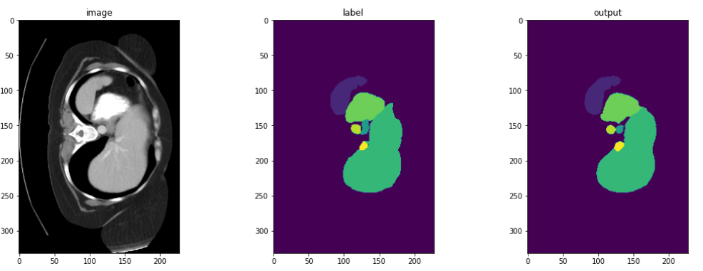

# 🏥 Abdomen 3D Segmentation Using UNETR 🚀

This project leverages the power of the **UNETR** model for precise 3D segmentation of abdominal organs, combining state-of-the-art Transformer-based encoders with CNN decoders for unparalleled accuracy.


## 📁 Project Structure

```
UNETR_3D_Abdomen_Segmentation/
│
├── data/
│   ├── imagesTr/
│   ├── imagesTs/
│   ├── labelsTr/
│   └── dataset_0.json
│
├── src/
│   ├── __init__.py
│   ├── data_loader.py
│   ├── model.py
│   ├── train.py
│   ├── evaluate.py
│   ├── utils.py
│   └── visualize.py
│
├── requirements.txt
├── README.md
└── .gitignore
```

- **`data/`**: Contains training and testing images and labels in `.nii.gz` format.
- **`src/`**: Source code for the project, organized into modules:
  - `data_loader.py`: Data loading and preprocessing functions.
  - `model.py`: Definition of the UNETR model.
  - `train.py`: Training script for model training.
  - `evaluate.py`: Script for model evaluation.
  - `utils.py`: Utility functions for model management.
  - `visualize.py`: Tools for visualizing predictions.
- **`requirements.txt`**: Python package dependencies.
- **`README.md`**: Documentation of the project.
- **`.gitignore`**: Files and directories to be ignored by Git.

## 🚀 Getting Started

Follow these instructions to set up and run the project on your local machine.

### 📋 Prerequisites

Ensure you have the following installed:

- Python 3.7+
- Pip (Python package manager)

### 🔧 Installation

1. **Clone the repository**:

   ```bash
   git clone https://github.com/yourusername/Abdomen-3D-Segmentation-UNETR.git
   cd Abdomen-3D-Segmentation-UNETR
   ```

2. **Install dependencies**:
   ```bash
   pip install -r requirements.txt
   ```

### 🏃‍♂️ Usage

#### Training the Model

To start training the UNETR model:

```bash
python src/train.py --data_dir data/ --epochs 100 --batch_size 2
```

- `--data_dir`: Path to the data directory.
- `--epochs`: Number of training epochs (default is 100).
- `--batch_size`: Batch size for training (default is 2).

#### Evaluating the Model

Evaluate the model on the validation dataset:

```bash
python src/evaluate.py --data_dir data/ --model_path models/model_epoch_100.pth
```

- `--model_path`: Path to the saved model checkpoint.

### 📊 Results

The model achieves an impressive **Dice score** of **0.8027** on the validation set, indicating high accuracy in segmenting abdominal organs.


### 🎨 Visualization

To visualize the model predictions:

```python
from src.visualize import visualize
import nibabel as nib

# Load sample data
image = nib.load('path_to_image.nii.gz').get_fdata()
label = nib.load('path_to_label.nii.gz').get_fdata()
prediction = nib.load('path_to_prediction.nii.gz').get_fdata()

# Visualize a specific slice
visualize(image, label, prediction, slice_idx=60)
```

This script displays the image, ground truth label, and model prediction side by side for a specified slice.



## 📚 Documentation

- **`data_loader.py`**: Handles loading and preprocessing of training and validation data.
- **`model.py`**: Contains the architecture for the UNETR model.
- **`train.py`**: Manages the training process, including loss calculation and model checkpointing.
- **`evaluate.py`**: Evaluates the model's performance on the validation dataset using the Dice metric.
- **`utils.py`**: Utility functions for saving and loading model checkpoints.
- **`visualize.py`**: Provides visualization functions for model predictions.

## 🛠️ Built With

- [MONAI](https://monai.io/) - Medical Open Network for AI
- [PyTorch](https://pytorch.org/) - Deep learning framework
- [NumPy](https://numpy.org/) - Numerical computations
- [Matplotlib](https://matplotlib.org/) - Plotting and visualization

## 📄 License

This project is licensed under the MIT License - see the [LICENSE](LICENSE) file for details.

## 🎉 Acknowledgments

- The developers of MONAI for providing excellent medical imaging tools.
- The creators of the UNETR architecture for their innovative approach to medical image segmentation.

---
